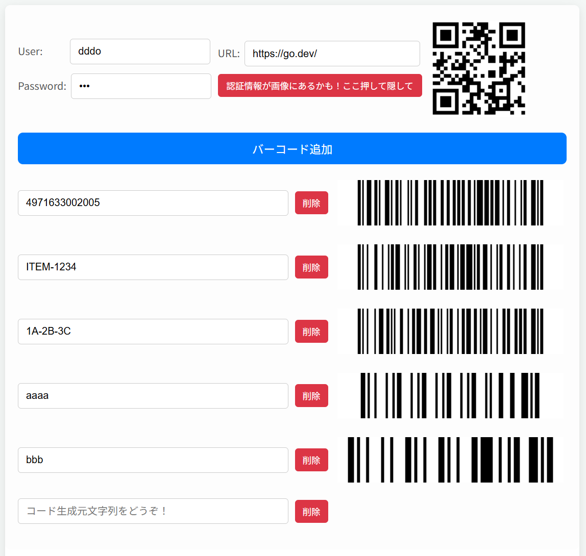

# barcode

https://ddddddo.github.io/barcode/

## 特徴・機能
### コード生成処理はWasmで実行されます
- コード生成処理は外部と通信せずlocalで完結します
- コード生成処理は、[github.com/boombuler/barcode](https://github.com/boombuler/barcode) を利用しています

### 1ページで複数バーコードを生成できます
- URLフォームにurlを入力するとそのQRコードが生成されます
    - User/Passwordフォームに、対象urlのBasic認証の認証情報を入れると、生成されるQRコードに埋め込まれます
- 「バーコード追加」ボタンを押すと、バーコードを複数生成できます
    - バーコードは、`CODE128` です

### URL用QRコードを隠せます
- 生成したURL用QRコードにBasic認証情報が含まれていると、このページをスクショで共有できないので、専用ボタンを押すことでQRコードを隠せます

### マウスオーバーで拡大・ぼかし
- 複数バーコードがあると、スキャンするときに別のバーコードをスキャンしてしまうことがあります。そういったとき、対象バーコードをマウスオーバーすることで拡大・他のバーコードをぼかして、スキャンしやすくします

### ページ内容をURLで共有できます
- クエリパラメータに、フォームに入力されたURLと各バーコード生成元の文字列を反映しています。それを使い、このページを復元します
- ただし、`User` / `Password` は共有するとダメなのでクエリパラメータに反映していません

- これまでのイメージは、以下で表示されます
    - **[https://ddddddo.github.io/barcode/?url=https%3A%2F%2Fgo.dev%2F&i1=4971633002005&i2=ITEM-1234&i3=1A-2B-3C&i4=aaaa&i5=bbb](https://ddddddo.github.io/barcode/?url=https%3A%2F%2Fgo.dev%2F&i1=4971633002005&i2=ITEM-1234&i3=1A-2B-3C&i4=aaaa&i5=bbb)**