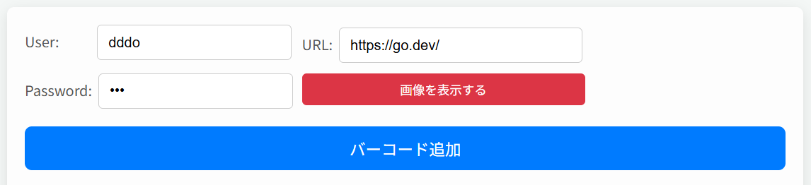
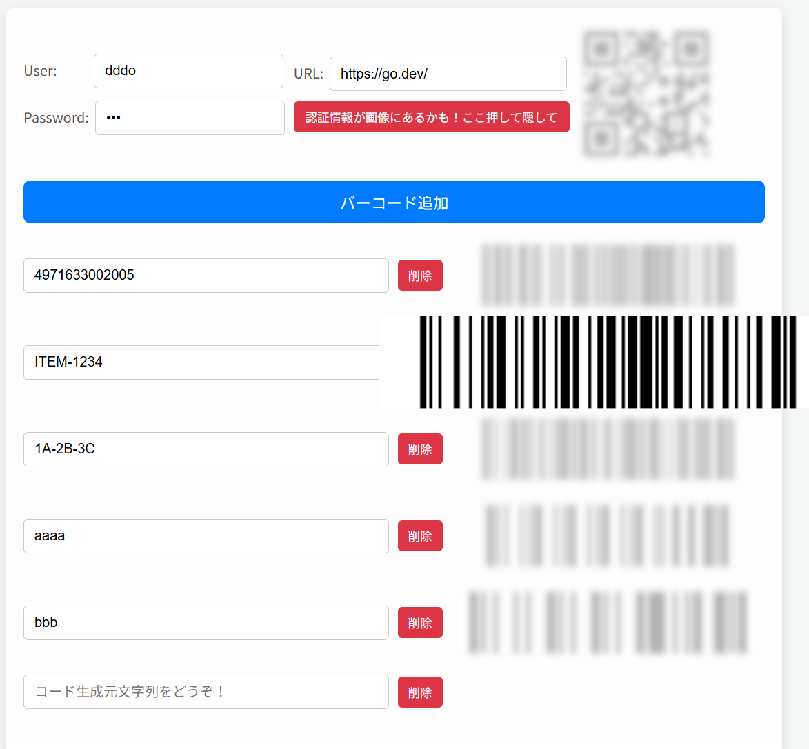

# barcode

https://ddddddo.github.io/barcode/

The site is in Japanese, but please translate it for your use.

## 特徴・機能 (Feature)
### コード生成処理はWasmで実行されます (Code generation process is performed in Wasm)
- コード生成処理は外部と通信せずlocalで完結します (The code generation process is completed locally, without communication with external parties.)
- コード生成処理は、[github.com/boombuler/barcode](https://github.com/boombuler/barcode) を利用しています (Code generation process uses github.com/boombuler/barcode)

### 1ページで複数バーコードを生成できます (Multiple barcodes can be generated on a single page)
- URLフォームにurlを入力するとそのQRコードが生成されます (Enter a URL in the URL form to generate a QR code for that URL.)
    - User/Passwordフォームに、対象urlのBasic認証の認証情報を入れると、生成されるQRコードに埋め込まれます (Enter the Basic Authentication credentials for the target URL in the User/Password form, and the credentials will be embedded in the generated QR code.)
- 「バーコード追加」ボタンを押すと、バーコードを複数生成できます (Click the “Add Barcode” button to generate multiple barcodes.)
    - バーコードは、`CODE128` です (The generated barcode is CODE128.)

### URL用QRコードを隠せます (QR Code for URL can be hidden.)
- 生成したURL用QRコードにBasic認証情報が含まれていると、このページをスクショで共有できないので、専用ボタンを押すことでQRコードを隠せます (If the QR code for the generated URL contains Basic Authentication information, the page cannot be shared in a screenshot, so you can hide the QR code by pressing the dedicated button.)

### マウスオーバーで拡大・ぼかし (Enlargement and blurring on mouse-over)
- 複数バーコードがあると、スキャンするときに別のバーコードをスキャンしてしまうことがあります。そういったとき、対象バーコードをマウスオーバーすることで拡大・他のバーコードをぼかして、スキャンしやすくします (When there are multiple barcodes, you may scan another barcode when scanning. In such cases, mouse-over the target barcode to enlarge and blur the other barcodes, making it easier to scan.)

### ページ内容をURLで共有できます (Share page content by URL)
- クエリパラメータに、フォームに入力されたURLと各バーコード生成元の文字列を反映しています。それを使い、このページを復元します (The query parameters reflect the URL entered in the form and the string from which each barcode was generated. Use it to restore this page)
- ただし、`User` / `Password` は共有するとダメなのでクエリパラメータに反映していません (However, User / Password is not reflected in the query parameter because it is not allowed to be shared.)

- これまでのイメージは、以下で表示されます (Previous images are shown below)
    - **[https://ddddddo.github.io/barcode/?url=https%3A%2F%2Fgo.dev%2F&i1=4971633002005&i2=ITEM-1234&i3=1A-2B-3C&i4=aaaa&i5=bbb](https://ddddddo.github.io/barcode/?url=https%3A%2F%2Fgo.dev%2F&i1=4971633002005&i2=ITEM-1234&i3=1A-2B-3C&i4=aaaa&i5=bbb)**